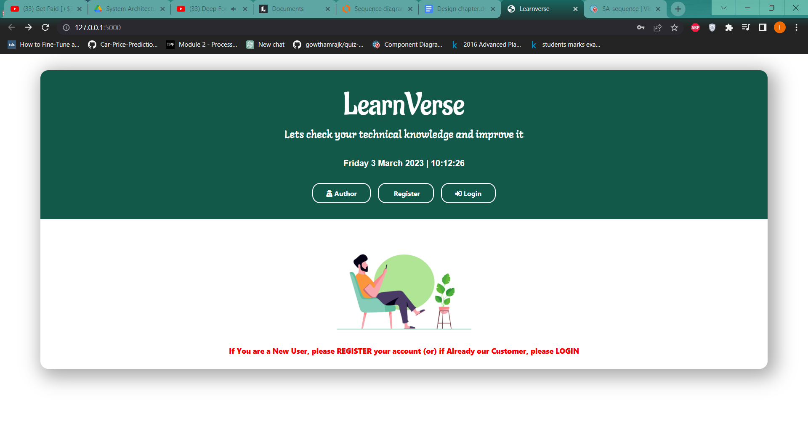
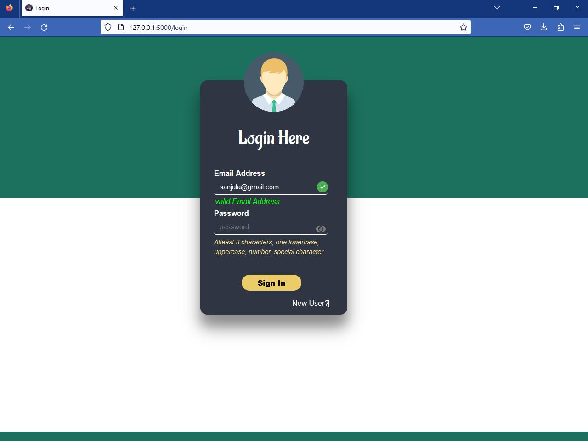
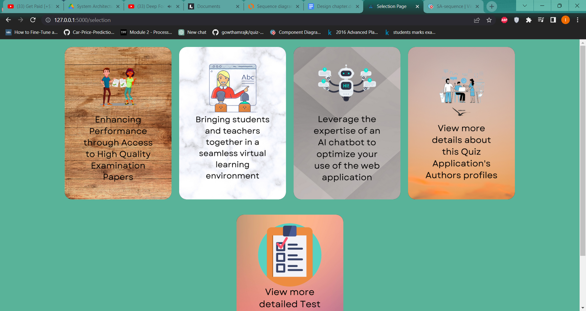
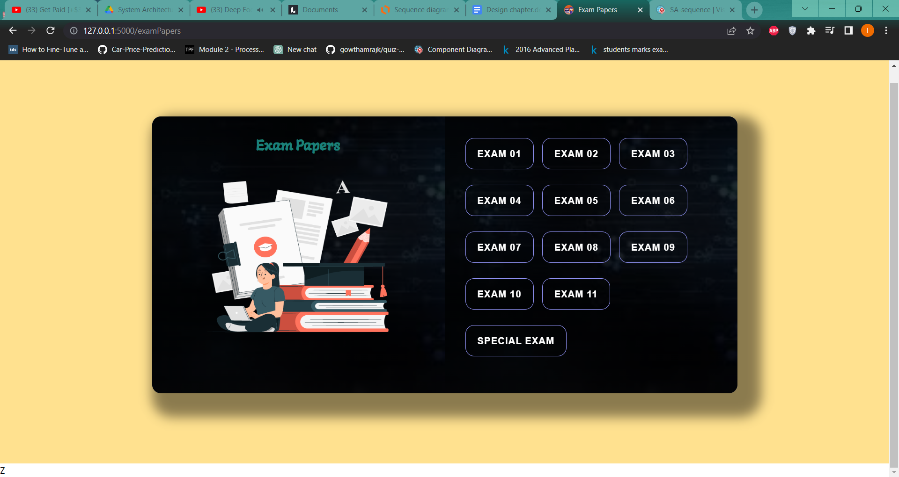
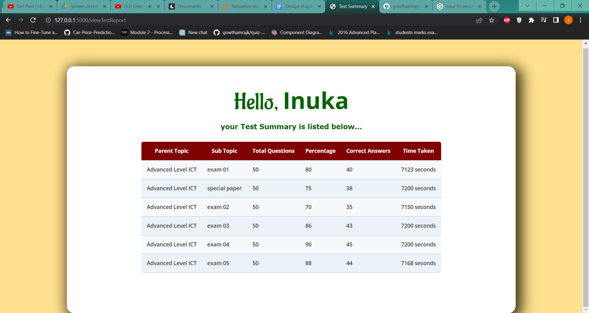
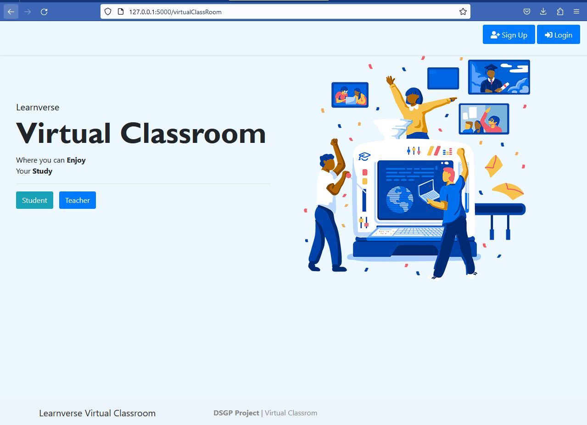

# Learnverse

A Flask-based web application that aids students in improving weaknesses by generating practise exams. 

## Overview

This Flask-based web application helps advanced level ICT students by generating customized practice exams, offering a virtual classroom to communicate with teachers, predicting potential exam grades, and providing an AI chatbot for additional assistance.

## Features

- Firebase authorization
- Exam paper generation based on users' performance
- Allows user to request specific lessons and receive custom exam papers tailored to his/her needs
- Leaderboard after successful completion of test
- Also, user can see the solution after doing a question in a test
- User can chat with AI chabot to clarify the doubts
- Enables users to share resources with one another and engage in chat communication.

## Screenshots
#### Landing Page:


#### Login Page:


#### Selection Page:


#### Exam Paper Selection:


#### Leaderboard:


#### Virtual Classroom:


# How To Use
### Prerequisites

Before you begin, ensure that you have met the following requirements:

- [PyCharm Community Edition](https://www.jetbrains.com/pycharm/download/) version 2021.2 or higher

You can install PyCharm Community Edition by downloading and running the installer for your operating system from the official JetBrains website.

### 1. Clone this repository

```bash
git clone https://github.com/inukarodrigo/Learnverse.git
```

### 2. Install [Pipenv](https://pipenv.pypa.io/en/latest/)

### 3. Create the virtualenv

```bash
## run following command from `Learnverse` directory
pipenv shell
```

### 4. Run development server

```bash
python app.py
```

## Contributors

We would like to thank the following contributors for their help with this project:

- [Lisara Gajaweera](https://github.com/LI3ARA)
- [Maneth Subawickrama](https://github.com/Maneth22)
- [Haneek Ahamed](https://github.com/HaneekAhamed)

